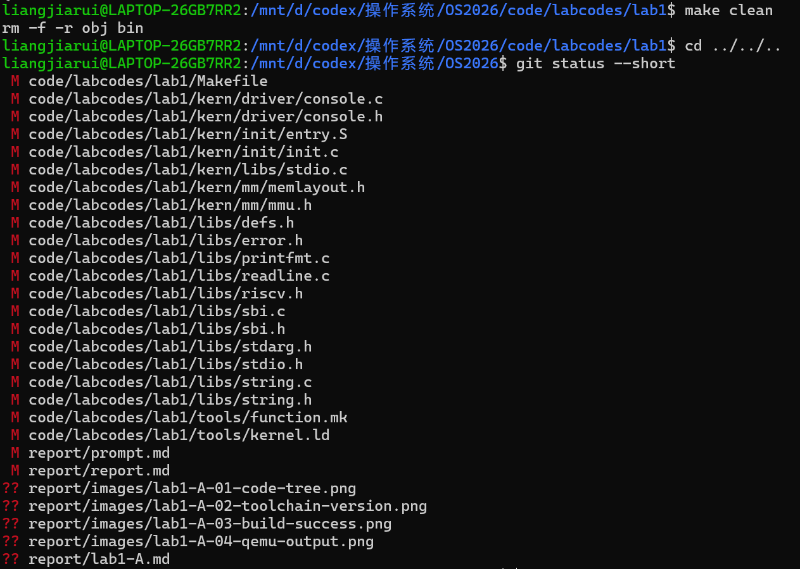

# 操作系统实验报告

## 实验基本信息

| 项目 | 内容 |
|------|------|
| **实验名称** | Lab 1: 最小可执行内核与启动流程 |
| **小组成员** | 成员A：代码结构、构建和运行负责人；成员B：启动流程和 GDB 验证负责人；成员C：SBI/console 理解、报告与交付负责人 |
| **完成日期** | 2026-10-08 |

### 小组分工

| 成员 | 负责的练习/模块 |
|------|----------------|
| 成员A | Lab1 工程代码整理、Makefile/链接脚本理解、构建流程、QEMU 运行验证、本文件撰写 |
| 成员B | 练习1、练习2、GDB 跟踪启动流程、调试截图 |
| 成员C | SBI/console 输出链路理解、总报告整合、prompt 汇总、GitHub 提交结构检查 |

实验报告分工：本文件 `lab1-A.md` 只覆盖成员A负责的代码结构、构建运行和相关原理说明；小组最终总报告可在此基础上合并成员B、成员C的内容。

---

## 一、实验目的

本实验的主要目的是理解一个最小可执行操作系统内核如何从源码变成可被 QEMU/OpenSBI 加载运行的镜像，并掌握 Lab1 工程的构建与运行流程。

1. 理解 Lab1 最小内核的工程结构，以及启动相关源码、链接脚本、构建脚本之间的关系。
2. 理解 `Makefile` 如何调用 RISC-V 交叉编译工具链，将 C/汇编源码编译、链接为 `bin/kernel`，再通过 `objcopy` 生成 `bin/ucore.img`。
3. 理解 `tools/kernel.ld` 如何指定内核入口 `kern_entry` 和加载地址 `0x80200000`。
4. 使用 QEMU 和 OpenSBI 运行最小内核，验证内核能够输出启动信息 `(THU.CST) os is loading ...`。

---

## 二、实验环境

本次成员A任务涉及的主要环境如下。

| 成员 | AI 编程工具 | 底层模型 | 备注 |
|------|------------|---------|------|
| 成员A | Codex 终端 Agent | GPT-5/Codex | 用于阅读 Lab1 代码结构和理解构建流程 |

本机当前仓库结构为：

```text
OS2026/
├── code/
│   └── labcodes/
│       └── lab1/
└── report/
    ├── images/
    ├── lab1-A.md
    ├── prompt.md
    └── report.md
```

成员A负责的 Lab1 代码位于：

```text
OS2026/code/labcodes/lab1
```

---

## 三、实验整体逻辑分析

### 3.1 本章节的逻辑主线

Lab1 围绕“最小可执行内核如何启动”展开。整个流程可以概括为：

```text
源代码
  -> 交叉编译生成目标文件
  -> 链接脚本安排内核内存布局并生成 ELF 内核
  -> objcopy 生成裸二进制镜像 ucore.img
  -> QEMU 启动 RISC-V virt 机器
  -> OpenSBI 初始化并跳转到 0x80200000
  -> entry.S 设置内核栈并进入 kern_init
  -> kern_init 清零 .bss 并调用 cprintf 输出启动信息
```

这个流程解决的问题是：在还没有完整操作系统、标准库和运行时环境的情况下，如何让一段最小内核代码被模拟硬件加载、执行，并通过 OpenSBI 提供的服务输出字符。

### 3.2 功能的逐步实现

1. 首先确定内核入口和内存布局。`tools/kernel.ld` 指定输出架构为 RISC-V，入口符号为 `kern_entry`，并将内核加载地址设置为 `0x80200000`，从而和 QEMU/OpenSBI 的加载约定对接。

2. 接着实现最小启动汇编。`kern/init/entry.S` 定义 `kern_entry`，通过 `la sp, bootstacktop` 设置内核栈，再通过 `tail kern_init` 进入 C 语言初始化函数。

3. 然后实现 C 语言入口。`kern/init/init.c` 中的 `kern_init` 清零 `.bss` 段，并通过 `cprintf` 输出启动信息，最后进入死循环，表示内核已经成功接管执行流。

4. 最后使用 Makefile 串起编译、链接、镜像生成和运行。`Makefile` 负责收集源文件、调用 `riscv64-unknown-elf-*` 工具链生成 `bin/kernel` 和 `bin/ucore.img`，并通过 `make qemu` 启动 QEMU。

---

## 四、实验内容与实现

### 功能模块：Lab1 工程构建与最小内核运行

**负责人：** 成员A

#### 模块功能描述

**涉及的主要文件：**

```text
Makefile
tools/function.mk
tools/kernel.ld
kern/init/entry.S
kern/init/init.c
kern/driver/console.c
kern/libs/stdio.c
libs/sbi.c
libs/printfmt.c
```

**需要重点理解的函数或符号：**

```c
// kern/init/init.c
int kern_init(void);

// kern/libs/stdio.c
int cprintf(const char *fmt, ...);

// kern/driver/console.c
void cons_putc(int c);

// libs/sbi.c
uint64_t sbi_call(uint64_t sbi_type, uint64_t arg0, uint64_t arg1, uint64_t arg2);
void sbi_console_putchar(unsigned char ch);
```

**功能说明：**

成员A负责确认 Lab1 代码能够作为最小内核完成构建和运行。该模块不需要新增复杂功能，重点是保证工程结构正确、构建链路清晰、运行结果可验证。

Lab1 的代码组织可以分为四层：

1. 构建层：`Makefile` 和 `tools/function.mk` 收集源文件并生成目标文件、依赖文件和最终镜像。
2. 链接层：`tools/kernel.ld` 指定 ELF 文件的入口、加载地址和各段布局。
3. 启动层：`kern/init/entry.S` 设置栈并跳转到 C 入口。
4. 输出层：`kern/init/init.c` 调用 `cprintf`，经过 console 和 SBI 封装，把字符输出到 QEMU 终端。

#### 最终提示词

以下是成员A任务中用于 AI 辅助阅读代码和理解构建流程的提示词：

````markdown
我现在负责操作系统 Lab1 小组分工中的成员A任务。请阅读 OS2026/code/labcodes/lab1 中的代码，重点分析 Makefile、tools/kernel.ld、kern/init/entry.S、kern/init/init.c 以及最小内核运行流程，帮助我理解 Lab1 的代码结构、构建流程、链接过程和 QEMU 运行流程。
````

#### 实现迭代过程

本模块没有新增内核功能代码，主要工作是检查现有 Lab1 工程是否满足成员A负责的构建运行要求，并整理交付内容。

##### 第一次迭代

**检查内容：**

- 检查 `OS2026/code/labcodes/lab1` 是否包含完整 Lab1 代码。
- 对比外层 `lab1` 与 `OS2026/code/labcodes/lab1`，确认代码内容一致。
- 检查 `OS2026` 是否位于 `lab1` 分支，且包含 `code/` 和 `report/` 目录。
- 检查本机是否能直接调用 `riscv64-unknown-elf-gcc`、`riscv64-unknown-elf-ld`、`riscv64-unknown-elf-objcopy`、`qemu-system-riscv64`。

**遇到的问题：**

- 本模块不涉及新增内核代码，主要风险在于构建环境、工具链路径和 QEMU 启动参数是否正确。

**问题解决策略：**

- 以源码为最终交付内容，不提交 `bin/`、`obj/` 等构建产物。
- 保持 `code/labcodes/lab1` 为源码交付状态。
- 通过构建、运行和清理后的 Git 状态截图验证成员A负责的工程组织与运行流程。

**最终结果：**

- Lab1 源码目录已经放在 `OS2026/code/labcodes/lab1`。
- 构建和运行验证截图已经补充到 `OS2026/report/images`。
- 清理后代码目录中未保留 `bin/`、`obj/` 等构建产物。

---

### 练习相关说明：成员A负责部分

成员A主要负责支撑练习验证的代码和运行环境说明。

练习1和练习2的完整问答由成员B负责；成员A需要提供的基础结论是：

1. `kern/init/entry.S` 是内核进入 C 代码前的最小启动入口。
2. `la sp, bootstacktop` 将内核栈顶地址装入 `sp` 寄存器，为之后的 C 函数调用准备栈空间。
3. `tail kern_init` 跳转到 C 语言入口 `kern_init`，并且不保留返回路径，因为内核初始化函数不会返回。
4. `tools/kernel.ld` 使内核入口位于 `0x80200000` 附近，与 OpenSBI/QEMU 加载内核镜像的位置一致。
5. `make qemu` 通过 QEMU 的 `-device loader,file=$(UCOREIMG),addr=0x80200000` 将镜像加载到指定物理地址运行。

---

## 五、测试与验证

以下为成员A负责部分的验证截图。

### 5.1 截图一：确认代码目录结构


### 5.2 截图二：确认工具链版本


### 5.3 截图三：编译生成内核镜像


### 5.4 截图四：QEMU 运行最小内核


### 5.5 截图五：确认没有留下构建产物后再提交



---

## 六、实验总结与收获

### 对操作系统的理解

1. 最小内核的启动依赖硬件、固件、链接脚本和入口代码之间的约定。对 Lab1 来说，关键地址是 `0x1000`、`0x80000000` 和 `0x80200000`：CPU 从复位地址进入固件，OpenSBI 完成初始化后再将控制权交给内核镜像。

2. 链接脚本是操作系统内核构建中非常关键的一环。普通应用程序可以依赖操作系统装载器，而内核必须自己明确入口点、加载地址和各段布局。

3. `entry.S` 的作用很小但非常关键。它负责在进入 C 语言代码前设置栈，使后续的函数调用有可用的运行环境。

4. 内核中的格式化输出不是调用宿主机的 C 标准库，而是通过 `cprintf`、console 层和 OpenSBI 的 `ecall` 服务逐层封装出来的。这说明操作系统内核必须自己建立基础运行能力。

5. 本实验还没有覆盖完整的进程管理、虚拟内存、文件系统和调度等内容，但它搭好了后续实验继续扩展的最小骨架。

### AI 协作开发的经验

本次成员A任务中，AI 主要用于阅读 Lab1 代码结构和理解构建流程。比较有效的方式是明确限制范围：只分析 Makefile、链接脚本、启动入口、C 语言初始化入口以及 QEMU 运行流程，不扩展到后续 Lab 的内存管理或中断内容。这样可以让代码阅读更集中，也能更准确地理解成员A负责的工程构建部分。
