# 操作系统实验报告

## 实验基本信息

| 项目 | 内容 |
|------|------|
| **实验名称** | Lab 1：最小可执行内核与启动流程 |
| **小组成员** | 梁家瑞（2411046）、刘蔚霖（2412727）、李培涛（2411041） |
| **完成日期** | 2026-10-09 |

### 小组分工

| 成员 | 负责的练习/模块 |
|------|----------------|
| 梁家瑞（成员 A） | 工程代码整理、Makefile 与链接脚本理解、构建流程和 QEMU 运行验证 |
| 刘蔚霖（成员 B） | 练习 1、练习 2，启动流程分析和 GDB 调试验证 |
| 李培涛（成员 C） | SBI/console 输出链路分析、报告整合、prompt 汇总、截图和 Git 交付检查 |

实验报告分工如下：成员 A 撰写工程结构、构建和运行部分；成员 B 撰写启动入口、复位流程、OpenSBI 和 GDB 验证部分；成员 C 撰写 SBI/console 输出链路、实验总结与交付检查，并负责将三位成员的内容、提示词和截图整合到最终报告。

---

## 一、实验目的

本实验围绕最小 RISC-V 内核从源码构建到启动运行的完整过程展开，目标是：

1. 理解 Lab1 的目录结构、交叉编译、链接和镜像生成过程。
2. 理解 QEMU 复位入口、OpenSBI 和内核 `kern_entry` 之间的控制权转移。
3. 理解 `entry.S` 设置内核栈、进入 `kern_init` 并输出启动信息的过程。
4. 理解 `cprintf` 到 SBI `ecall` 的字符输出链路。
5. 使用编译、QEMU 和 GDB 证据验证上述流程，并记录不同环境造成的限制。

## 二、实验环境

| 成员 | AI 编程工具 | 底层模型 | 备注 |
|------|------------|---------|------|
| 梁家瑞（2411046） | Codex 终端 Agent | GPT-5/Codex | 阅读代码结构、构建流程和运行结果 |
| 刘蔚霖（2412727） | DeepSeek Harness | DeepSeek-Flash | 在 macOS 上完成补充 GDB 调试 |
| 李培涛（2411041） | DeepSeek Harness | DeepSeek-Flash | 整理 SBI/console、报告和交付材料 |

正式 Lab1 环境使用 RISC-V 交叉工具链和 QEMU 4.1.1。成员 B 另外使用 Homebrew 的 `riscv64-elf-*` 工具链和 QEMU 11.1.2 完成了补充调试；该环境用于观察 GDB 流程，不能替代 QEMU 4.1.1 的正式验证。

代码目录为：

```text
code/labcodes/lab1
```

## 三、实验整体逻辑分析

### 3.1 逻辑主线

Lab1 的启动链路如下：

```text
C/汇编源码
  → Makefile 调用 RISC-V 交叉工具链
  → kernel.ld 安排入口和内存布局
  → 生成 bin/kernel 和 bin/ucore.img
  → QEMU 复位 ROM 从 0x1000 开始执行
  → OpenSBI 初始化并准备进入内核
  → kern_entry 在 0x80200000 设置内核栈
  → tail kern_init 进入 C 语言初始化
  → cprintf 经过 console 和 SBI 输出启动信息
```

### 3.2 功能实现顺序

1. 成员 A 先确认 Makefile、链接脚本和源码目录能够生成内核 ELF 与裸镜像。
2. 成员 B 再观察 QEMU 复位地址、OpenSBI、`kern_entry` 和内核栈变化，回答练习 1、练习 2。
3. 成员 C 分析 `cprintf` 到 `ecall` 的输出链路，说明格式化输出与 SBI 固件服务之间的接口边界。
4. 最后由成员 C 汇总三人的报告、prompt、截图和 Git 交付结构。

## 四、实验内容与实现

### 功能模块一：工程构建与最小内核运行

**负责人：** 梁家瑞（2411046）

#### 模块功能描述

涉及的主要文件：

```text
Makefile
tools/function.mk
tools/kernel.ld
kern/init/entry.S
kern/init/init.c
kern/driver/console.c
kern/libs/stdio.c
libs/sbi.c
libs/printfmt.c
```

`Makefile` 收集 C 和汇编源文件，调用 `riscv64-unknown-elf-*` 工具链生成目标文件、`bin/kernel` 和 `bin/ucore.img`。`tools/kernel.ld` 将入口设为 `kern_entry`，并把内核基地址设为 `0x80200000`。`entry.S` 设置 `sp` 后跳转到 `kern_init`；`init.c` 清零 BSS、调用 `cprintf` 并进入死循环。

#### 最终提示词

```text
[PROMPT]
请阅读 OS2026/code/labcodes/lab1 中的 Makefile、tools/kernel.ld、kern/init/entry.S 和 kern/init/init.c，解释 Lab1 的代码结构、构建流程、链接过程和 QEMU 启动流程。

[RELY]
- 以当前 Lab1 源码和 Makefile 为准。
- 重点关注 kern_entry、kern_init、kernel.ld、bin/kernel 和 bin/ucore.img。

[GUARANTEE]
- 不修改无关代码。
- 区分源码确认、命令实测和环境限制。
- 不把未执行的 QEMU 或测试命令写成通过。

[SPECIFICATION]
- 说明源文件、链接脚本、交叉编译器、objcopy 和 QEMU 之间的关系。
- 记录实际构建命令、关键输出和截图位置。
```

#### 实现与验证

本模块没有新增内核功能代码，主要工作是确认现有工程能够构建和运行。成员 A 使用 `make clean`、`make` 和 `make qemu` 验证构建与启动，并记录了工具链和 QEMU 4.1.1 版本。当前交付目录没有 `tools/grade.sh`，因此没有把 `make grade` 写成已通过。

### 功能模块二：启动入口与 GDB 验证

**负责人：** 刘蔚霖（2412727）

#### 练习 1：理解内核入口

`tools/kernel.ld` 使用 `ENTRY(kern_entry)` 指定 ELF 入口，并将代码放置在 `0x80200000`。`kern/init/entry.S` 中：

```asm
la sp, bootstacktop
tail kern_init
```

`la sp, bootstacktop` 将启动栈顶地址装入 `sp`，为后续 C 函数调用准备内核栈。源码中 `KSTACKPAGE` 为 2，若页大小为 4096 字节，则 `KSTACKSIZE` 为 8192 字节，栈从高地址向低地址增长。

`tail kern_init` 将控制权转移给 `kern_init`，不保存新的返回地址。由于 `kern_init` 被声明为 `noreturn`，并且最后进入无限循环，因此启动入口不会返回。

补充 GDB 调试中观察到 `bootstacktop = 0x80203000`，执行 `la` 展开的两条机器指令后 `sp` 变为该地址。对应截图为 `gdb-entry.png` 和 `gdb-stack.png`。

#### 练习 2：观察复位和 OpenSBI 启动流程

成员 B 在 QEMU 11.1.2 的补充环境中观察到初始 `pc = 0x1000`。复位 ROM 中的六条指令读取 hart 编号和启动参数，然后跳转到 `0x80000000` 的 OpenSBI。OpenSBI 完成机器级初始化后，将控制权交给 `0x80200000` 的 `kern_entry`。

该反汇编属于 QEMU 11.1.2 的启动 ROM，不能直接当作 QEMU 4.1.1 的固定指令序列。报告中的结论限定为“复位 ROM 设置启动参数并进入 OpenSBI”，具体寄存器操作以实际 QEMU 版本为准。

#### 最终提示词

```text
[PROMPT]
请使用 QEMU 和 GDB 观察 Lab1 的复位地址、OpenSBI、kern_entry、内核栈和 kern_init，并回答练习 1、练习 2。

[RELY]
- 以 kern/init/entry.S、tools/kernel.ld 和实际 GDB 输出为准。
- 分别记录 pc、sp、bootstacktop、OpenSBI 入口和内核入口。

[GUARANTEE]
- 不把指导书中的旧地址当作当前实测结果。
- 区分 QEMU 版本差异和 Lab1 内核源码。
- 只有截图或命令实际显示的寄存器值才能写入报告。

[SPECIFICATION]
- 覆盖 0x1000 复位 ROM、0x80000000 OpenSBI 和 0x80200000 kern_entry。
- 记录断点、单步、反汇编和寄存器检查命令。
- 说明 la sp 和 tail kern_init 的作用。
```

### 功能模块三：SBI 与 console 输出链路

**负责人：** 李培涛（2411041）

#### 模块功能描述

本模块解释以下调用链：

```text
cprintf
  → vcprintf
    → vprintfmt
      → cputch
        → cons_putc
          → sbi_console_putchar
            → sbi_call
              → ecall
                → OpenSBI
                  → QEMU 控制台
```

`vprintfmt` 只负责解析格式字符串和生成字符，通过 `putch` 回调输出；`cputch` 负责计数并调用 `cons_putc`；`cons_putc` 将字符交给 SBI。`sbi_call` 使用 `x17/a7` 传递服务号，`x10/a0` 传递字符，`x11/a1` 和 `x12/a2` 在本次调用中为 0，最后通过 `ecall` 进入 OpenSBI。

#### 涉及的主要文件和函数

```text
libs/printfmt.c              vprintfmt
kern/libs/stdio.c            cprintf、vcprintf、cputch
kern/driver/console.c       cons_putc
libs/sbi.c                   sbi_call、sbi_console_putchar
libs/sbi.h                   SBI 接口声明
```

`cputch` 每输出一个字符就增加计数器，因此 `vcprintf` 可以返回本次输出的字符数量。`sbi_console_putchar` 使用传统 SBI console putchar 服务号 1；内核不直接访问 QEMU 串口寄存器，而是通过 OpenSBI 提供的固件接口完成输出。

#### 最终提示词

```text
[PROMPT]
请阅读 Lab1 的 sbi.c、sbi.h、console.c、stdio.c 和 printfmt.c，整理 SBI/console 输出链路的独立报告。

[RELY]
- 以当前源码为准，核对函数签名、服务号和寄存器。
- 输出链路为 cprintf → vcprintf → vprintfmt → cputch → cons_putc → sbi_console_putchar → sbi_call → ecall → OpenSBI。

[GUARANTEE]
- 区分格式化、字符计数、console 封装、SBI 调用和 QEMU 输出。
- 不把未执行的 GDB、QEMU 或 grade 结果写成通过。
- 未知个人信息保留待补。

[SPECIFICATION]
- 解释 putch、putdat、va_list、a7/a0-a2 和 ecall。
- 给出源码文件、验证命令、截图文件名和未验证限制。
```

#### 实现与验证

成员 C 整理了 SBI/console 草稿、截图命名和报告引用。现有 `member-c-gdb-cons-putc.jpg`、`member-c-ecall-disassembly.jpg`、`member-c-make-qemu.jpg` 等图片用于支持调用栈、`ecall` 反汇编和 QEMU 输出结论。单独显示 `ecall` 指令不能证明寄存器参数，寄存器结论必须以 GDB 实际输出为准。

## 五、测试与验证

### 5.1 工具链和 QEMU 版本

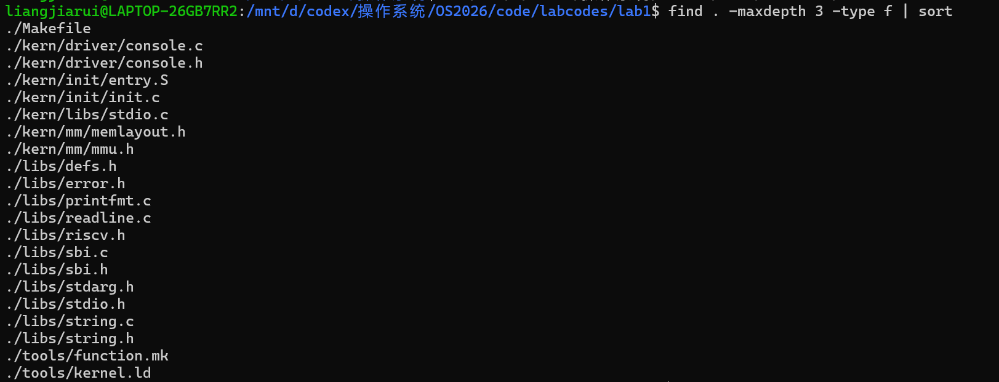

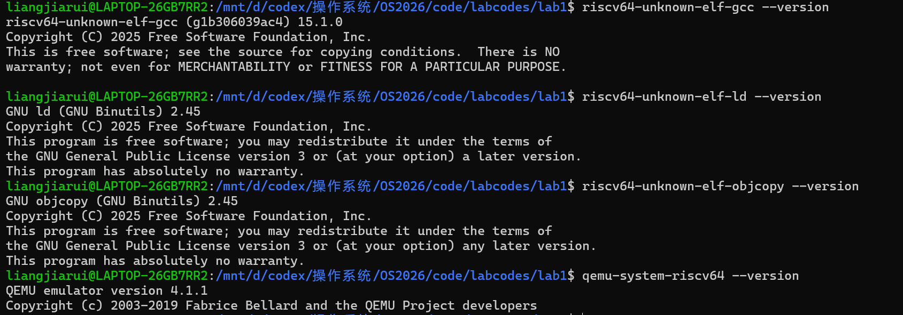

上述截图显示 Lab1 代码目录、RISC-V 工具链版本和 QEMU 4.1.1。成员 C 的 `member-c-qemu-version.jpg` 可作为同一环境的补充版本记录。

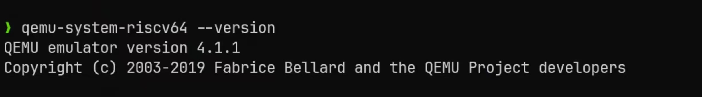

### 5.2 编译生成镜像

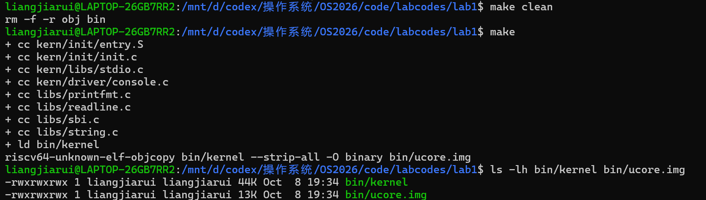

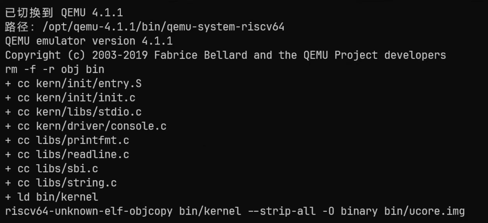

截图显示执行 `make clean`、`make` 后生成 `bin/kernel` 和 `bin/ucore.img`。

### 5.3 QEMU 启动输出

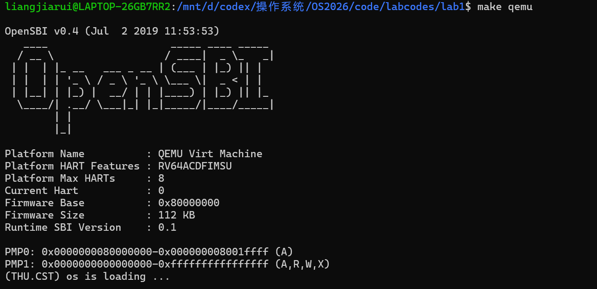

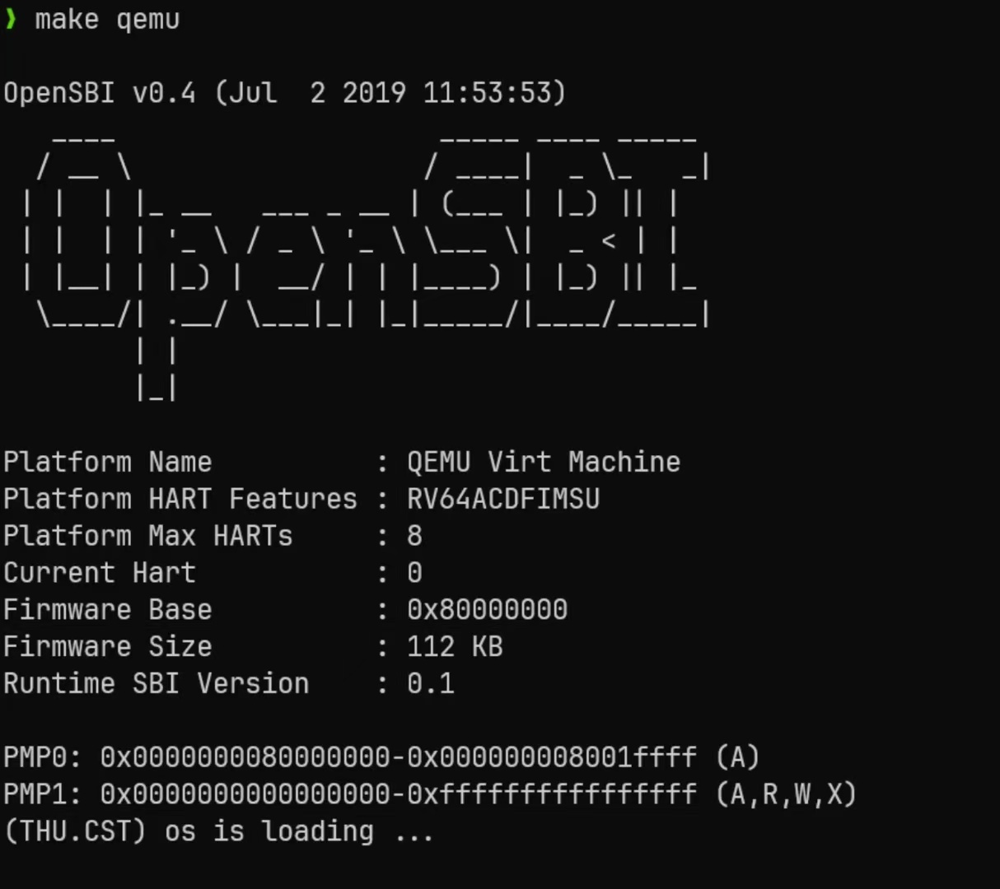

截图显示 OpenSBI 启动信息和 `(THU.CST) os is loading ...`。该证据证明内核能够启动并输出信息，但单独不能证明完整函数调用链。

### 5.4 复位 ROM 到 OpenSBI

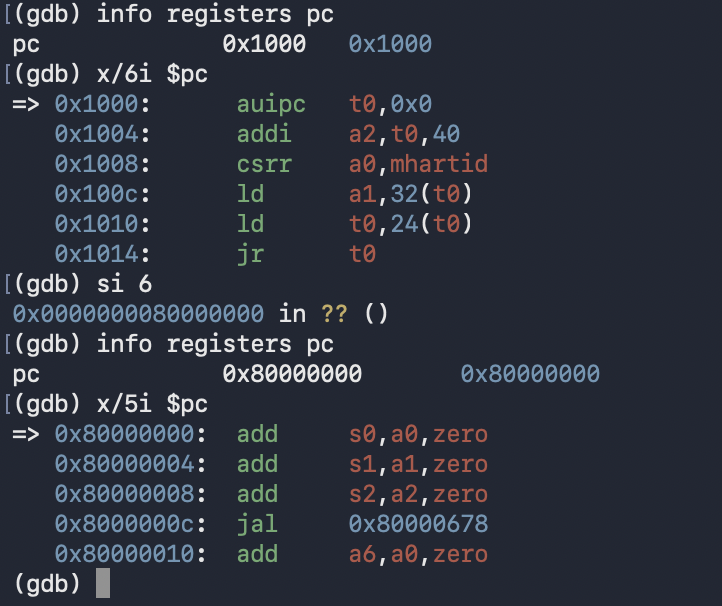

该截图来自成员 B 的 QEMU 11.1.2 补充环境，显示 `pc = 0x1000`、复位 ROM 反汇编以及单步后到达 `0x80000000`。

### 5.5 内核入口和栈设置

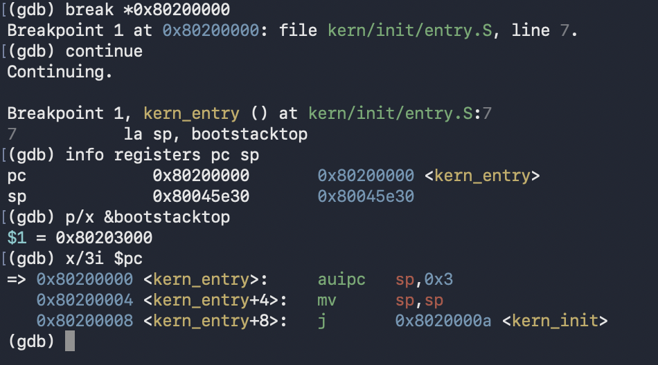

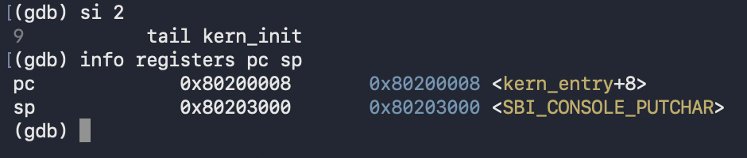

两张截图分别支持命中 `kern_entry`、观察 `bootstacktop` 和执行 `la sp` 后的 `sp` 变化。

### 5.6 SBI/console 调试材料

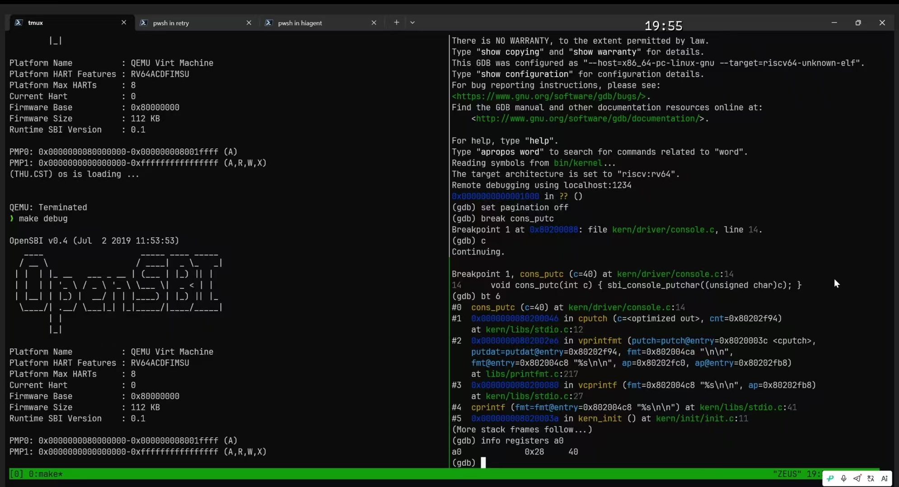

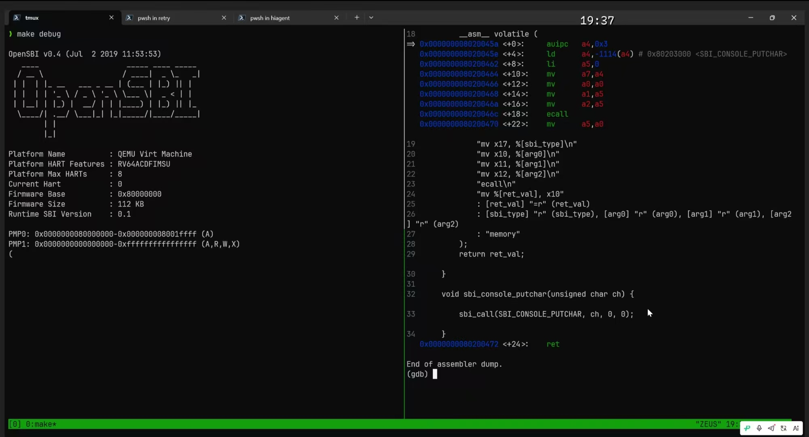

这些图片用于补充 console 调用栈、SBI 边界和 QEMU 控制台输出。报告只把截图中实际出现的命令、地址和寄存器值作为验证结论。

## 六、实验总结与收获

### 对操作系统的理解

1. 内核启动依赖 QEMU 复位 ROM、OpenSBI、链接脚本和内核入口之间的地址约定。
2. `entry.S` 在进入 C 代码前建立内核栈；`kern_init` 清零 BSS、输出启动信息并停留在内核中。
3. `vprintfmt` 将格式化逻辑与具体输出设备解耦，`putch` 回调决定字符最终如何发送。
4. SBI 为内核提供了统一的固件调用接口；`ecall` 是内核进入 OpenSBI 的边界，QEMU 负责提供虚拟硬件环境。
5. 本实验尚未覆盖进程管理、虚拟内存、文件系统和调度，但已经建立了后续实验需要的最小内核骨架。

### AI 协作开发的经验

三位成员分别限定了自己的阅读和验证范围：成员 A 聚焦构建链路，成员 B 聚焦 GDB 和启动地址，成员 C 聚焦 SBI/console 和交付整理。有效的做法是让每个结论都回到源码、命令或截图，并单独记录 QEMU 版本、工具链前缀和未验证部分，避免将推断写成实测结果。
